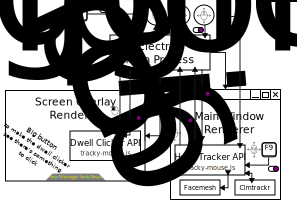

#  Tracky Mouse

> Control your computer by moving your head.

Tracky Mouse is intended to be a complete UI for head tracking, similar to [eViacam](https://github.com/cmauri/eviacam), but embeddable in web applications (such as [JS Paint, with its Eye Gaze Mode](https://jspaint.app/#eye-gaze-mode), which I might rename Hands-Free Mode or Facial Mouse Mode), as well as downloadable as an application to use to control your entire computer.

I'm also thinking about making a browser extension, which would 1. bridge between the desktop application and web applications, making it so you don't need to disable dwell clicking in the desktop app to use a web app that provides dwell clicking, 2. provide the equivalent of the desktop application for Chrome OS, and 3. automatically enhance webpages to be friendlier toward facial mouse input, by preventing menus from closing based on hover, enlarging elements etc., probably using site-specific enhancements.

So this would be a three-in-one project: desktop app, JavaScript library, and browser extension.
Sharing code between these different facets of the project means a lot of improvements can be made to three different products at once, and the library means that applications can have a fully functional facial mouse UI, and get people interested in head tracking because they can try it out right away.

Options could be exported/imported or even synced between the products.

[✨👉 **Try out the Demo!** 👈✨](https://1j01.github.io/tracky-mouse/)

## Why did I make this?

- eViacam isn't working on my computer
- There's not that much facial mouse software out there, especially cross-platform, and I think it's good to have options.
- I want people to be able to try JS Paint's Eye Gaze Mode out easily, and an embeddable facial mouse GUI would be great for that. (Backstory: Someone emailed me asking how they might build an eye gaze mode into jspaint, and so I built it for them. I want to build it into something a lot of people can use.)
- Sometimes my joints hurt a lot and I'd like to relieve strain by switching to an alternative input method, such as head movement. Although I also have serious neck problems, so I don't know what I was thinking. Working on this project I have to use it very sparingly, using a demo video instead of camera input whenever possible for testing.

## Libraries Used

- [jsfeat](https://github.com/inspirit/jsfeat) for point tracking
	- [MIT License](https://github.com/inspirit/jsfeat/blob/master/LICENSE)
- [clmtrackr.js](https://github.com/auduno/clmtrackr) for fast and lightweight but inaccurate face tracking
	- [MIT License](https://github.com/auduno/clmtrackr/blob/dev/LICENSE.txt)
- [facemesh](https://github.com/tensorflow/tfjs-models/tree/master/facemesh#mediapipe-facemesh) and [TensorFlow.js](https://www.tensorflow.org/) for accurate face tracking (once this loads, it stops using clmtrackr.js)
	- [Apache License 2.0](https://github.com/tensorflow/tfjs-models/blob/master/LICENSE)
	- [Apache License 2.0](https://github.com/tensorflow/tensorflow/blob/master/LICENSE)

## Software Architecture

The desktop application's architecture is kind of *amusing*, which is the only reason I mention it.

I will explain. Electron apps are multi-process programs. They have a main process, which creates browser windows, and renderer processes, which render the content of the browser windows.

In this app, there are two renderer processes, one for the main application window, and one for a screen overlay window.

The overlay window is transparent, always-on-top, and intangible. It's used to preview dwell clicks with a shrinking circle.

In a "sane" architecture, the overlay window, which can't receive any input directly, would be purely a visual output. The state would be kept in either the main process or the main renderer process, and it would only send messages to the overlay to draw the circle.

But I already had code for the dwell clicker, you see. I want it to behave similarly between the library and the desktop app, so I want the same timing logic and circle drawing to work in both.

Keeping the state in a separate process from where the circle is rendered would be tearing apart and rewriting my code for the dwell clicker.

So instead I simply embed the dwell clicker into the screen overlay window, business logic and all.
It was already going to be an entire webpage just to render the circle, since this is Electron.
It was never going to be efficient.

So I ended up with an architecture where the **application window controls mouse movement**, and the **screen overlay window controls mouse clicking**, which I think is *pretty epic*. 😎

It genuinely was a good way to reuse the code for the dwell clicker.

Oh also I made a big, screen-sized, **invisible button**, so that the dwell clicker thinks there's something to click on. Pretty silly, but also pretty simple. 🆒

**Not pictured:** the renderer processes have preload scripts which are more privileged code than the rest of the renderer's code. Access to system functionality passes through the preload scripts.

The architecture for normal usage of the library is much simpler.

Ooh, but the diagram for the desktop app interacting with web pages (including pages using the library) through the browser extension would be interesting. That's all theoretical for now though.

## License

MIT-licensed, see [LICENSE.txt](./LICENSE.txt)

## Development Setup

- [Clone the repo.](https://help.github.com/articles/cloning-a-repository/)
- Install [Node.js](https://nodejs.org/) if you don't have it
- Open up a command prompt / terminal in the project directory.
- Run `npm install`
- Run `npm run dev` to start a web server that will automatically reload when files change.
- For the electron app:
	- Then `cd tracky-mouse-electron && npm install`

## Install Desktop App

The app is not yet distributed as precompiled binaries.
If you want to try out the desktop app in the meantime:

- See Development Setup
- In folder `tracky-mouse-electron`, run `npm start`

## Add to your project

Tracky Mouse is available on npm:
`npm i tracky-mouse`

Read the [API documentation](./API.md) for more information.

## Changelog

See [CHANGELOG.md](./CHANGELOG.md) for project history and API changes.

